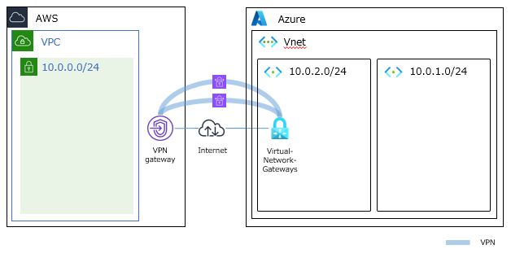

## 概要
　本ドキュメントは、AWSとAzure間のVPN Connectionを構築するためのマニュアルです。 
以下の通り、VPN ConnectionでAWS VGW～Azure VGW間を接続します。 

## 利用方法
### AWS作成
1. VPC作成
   * 名前「sample-vpc」、IPv4 CIDRブロック「10.0.0.0/24」で作成。
   * 名前「sample-subnet」、アベイラビリティ―ゾーン「ap-northeast-1a」、IPv4 CIDRブロック「10.0.0.0/24」で作成。 
1. 仮想プライベートゲートウェイ作成 
   * 名前「sample-vgw」、ASN「AmazonデフォルトASN(64512)」で作成。 
   * VPC「sample-vpc」へアタッチ。 ※「Azure作成」の「1.Vnet作成」へ
1. カスタマゲートウェイ作成 
   * 名前「sample-cgw」、ルーティング「動的」、BGP ASN「65000」、IPアドレス「(Azure側のアドレス)」で作成。 
1. サイト間VPN接続作成 
   * 名前「sample-vpn」、ターゲットゲートウェイタイプ「仮想プライベートゲートウェイ」、トンネル1の内部IPv4 CIDR「169.254.21.0/30」、トンネル1の事前共有キー「samplekey」、トンネル2の内部IPv4 CIDR「169.254.22.0/30」、トンネル1の事前共有キー「samplekey」、で作成。
   * Tunnel1、Tunnel2のピアアドレスを確認。 ※「Azure作成」の「3.ローカルネットワークゲートウェイ作成」へ 
 

### Azure作成
1. Vnet作成 
   * 名前「sample-vnet」、地域「(Asia Pacific) Japan East」で作成。 
   * サブネットの目的「Default」、名前「sample-subnet」、CIDR「10.0.1.0/25」で作成。
   * サブネットの目的「Virtual Network Gateway」、CIDR「10.0.1.128/29」で作成。
1. 仮想ネットワークゲートウェイ作成 
   * 名前「sample-vgw」、ゲートウェイの種類「VPN」、SKU「VpnGW1」、仮想ネットワーク「sample-vnet」、パブリックIPアドレス「新規作成」、パブリックIPアドレス名「sample-pip」、アクティブ/アクティブ モードの有効化「無効」、BGPの構成「有効」、自律システム番号「65000」、カスタムの Azure APIPA BGP IP アドレス「169.254.21.2, 169.254.22.2」で作成。 ※「AWS作成」の「3.カスタマゲートウェイ作成」へ 
1. ローカルネットワークゲートウェイ作成 
   * 名前「sample-lgw1」、IPアドレス「(AWS側のアドレス1)」、BGP設定の構成「はい」、自律システム番号「64512」、BGPピアのIPアドレス「169.254.21.1」で作成。 
   * 名前「sample-lgw2」、IPアドレス「(AWS側のアドレス2)」、BGP設定の構成「はい」、自律システム番号「64512」、BGPピアのIPアドレス「169.254.22.1」で作成。 
1. 接続作成 
   * 接続の種類「サイト対サイト(IPsec)」、名前「sample-con1」、仮想ネットワークゲートウェイ「sample-vgw」、ローカルネットワークゲートウェイ「sample-lgw1」、IKEプロトコル「IKEv2」、BGPを有効にする「✓」、プライマリBGPアドレスを有効にする「✓」、プライマリカスタムBGPアドレス「169.254.21.2」で作成。
   * 接続の種類「サイト対サイト(IPsec)」、名前「sample-con2」、仮想ネットワークゲートウェイ「sample-vgw」、ローカルネットワークゲートウェイ「sample-lgw2」、IKEプロトコル「IKEv2」、BGPを有効にする「✓」、プライマリBGPアドレスを有効にする「✓」、プライマリカスタムBGPアドレス「169.254.22.2」で作成。
 

### AWS削除
1. サイト間VPN接続削除
   * 名前「sample-vpn」を削除。
1. カスタマゲートウェイ削除
   * 名前「sample-cgw」を削除。
1. 仮想プライベートゲートウェイ削除 
   * VPC「sample-vpc」からデタッチ。
   * 名前「sample-vgw」を削除。 
1. VPC削除
   * 名前「sample-vpc」を削除。
 

### Azure削除
1. 接続削除
   * 名前「sample-con1」を削除。
   * 名前「sample-con2」を削除。
1. ローカルネットワークゲートウェイ削除
   * 名前「sample-lgw1」を削除。
   * 名前「sample-lgw2」を削除。
1. 仮想ネットワークゲートウェイ削除
   * 名前「sample-vgw」を削除。 
   * 名前「sample-pip」を削除。
1. Vnet削除
   * Vnet「sample-vnet」を削除

## 関連技術
</img> </img>
